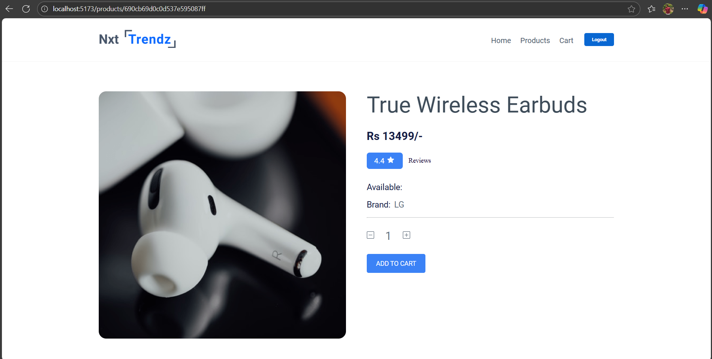

# E-Commerce Shopping Cart Application

A full-stack e-commerce platform built with React and Node.js, featuring user authentication, product browsing with filters, shopping cart management, and order history tracking.

## Screenshots

### Authentication


### Product Browsing




### Shopping & Checkout


## Demo Video
[Watch Demo Video](https://www.loom.com/share/8ee394704aa041128631a7b5b08ab5e1)

## Features

### User Authentication
- User registration and login system
- JWT-based authentication
- Secure password hashing with bcrypt
- Protected routes for authenticated users

### Product Catalog
- Browse through multiple product categories (Clothing, Electronics, Appliances, Grocery, Toys)
- Search products by name or brand
- Filter by category and rating
- Sort products by price (high to low, low to high)
- View detailed product information

### Shopping Cart
- Add products to cart with quantity selection
- Update item quantities directly from cart
- Remove individual items
- Real-time cart total calculation
- Cart syncs with server when logged in

### Checkout & Orders
- Secure checkout process with confirmation dialog
- Order receipt generation with order ID and timestamp

### Responsive Design
- Mobile-friendly interface
- Works seamlessly across desktop, tablet, and mobile devices

## Tech Stack

**Frontend:**
- React 18
- React Router for navigation
- Context API for state management
- Vite for fast development and builds
- CSS3 for styling

**Backend:**
- Node.js with Express
- MongoDB with Mongoose ODM
- JWT for authentication
- bcrypt for password security

## Project Structure

```
Mock_Ecom_Cart/
├── Backend/
│   ├── models/           # Database schemas
│   ├── routes/           # API endpoints
│   ├── middleware/       # Authentication middleware
│   ├── server.js         # Express server setup
│   └── seedProducts.js   # Database seeding script
│
└── Frontend/
    ├── public/
    └── src/
        ├── components/   # React components
        ├── context/      # Context API setup
        ├── services/     # API service functions
        └── App.jsx       # Main application component
```

## Setup Instructions

### Prerequisites
Make sure you have the following installed on your system:
- Node.js (v14 or higher)
- MongoDB Atlas account (or local MongoDB installation)
- npm or yarn package manager

### Backend Setup

1. Navigate to the Backend directory:
```bash
cd Backend
```

2. Install dependencies:
```bash
npm install
```

3. Create a `.env` file in the Backend directory (copy from .env.example):
```bash
cp .env.example .env
```

4. Edit the `.env` file with your actual values:
```
MONGODB_URI=your_mongodb_connection_string
JWT_SECRET=your_secret_key_here
PORT=5000
```

Replace `your_mongodb_connection_string` with your actual MongoDB connection string and `your_secret_key_here` with a secure random string.

5. Seed the database with sample products:
```bash
node seedProducts.js
```

6. Start the backend server:
```bash
npm start
```

The server should now be running on http://localhost:5000

### Frontend Setup

1. Open a new terminal and navigate to the Frontend directory:
```bash
cd Frontend
```

2. Install dependencies:
```bash
npm install
```

3. Start the development server:
```bash
npm run dev
```

The application should now be running on http://localhost:5173

## Demo Accounts

Two demo accounts are automatically created when you start the backend server:

**Account 1:**
- Email: rahul@demo.com
- Password: rahul@2021

**Account 2:**
- Email: raja@demo.com
- Password: raja@2021

You can also create your own account using the registration page.

## Usage Guide

### Getting Started
1. Open your browser and go to http://localhost:5173
2. You'll see the home page with options to login or register
3. Login with one of the demo accounts or create a new account

### Browsing Products
1. Click on "Products" in the navigation menu
2. Use the search bar to find specific products
3. Apply filters by category or rating
4. Sort products by price using the dropdown menu

### Managing Cart
1. Click on any product to view its details
2. Select quantity and click "Add to Cart"
3. View your cart by clicking the cart icon in the header
4. Update quantities using + and - buttons
5. Remove items individually or clear the entire cart

### Placing Orders
1. Go to your cart page
2. Review your items and total
3. Click "Checkout" button
4. Confirm your order in the dialog
5. View your order receipt with order details
6. Receipt is automatically saved to your order history

### Viewing Order History
1. Click on "Orders" in the navigation menu
2. See all your past orders with complete details
3. Each order shows order ID, date, items, and total amount

## API Endpoints

### Authentication
- `POST /api/auth/register` - Register new user
- `POST /api/auth/login` - User login

### Products
- `GET /api/products` - Get all products (supports filters)
- `GET /api/products/:id` - Get single product details

### Cart (Protected)
- `GET /api/cart` - Get user's cart
- `POST /api/cart` - Add item to cart
- `DELETE /api/cart/:productId` - Remove item from cart
- `DELETE /api/cart` - Clear entire cart
- `POST /api/cart/checkout` - Checkout and create order


## Development

### Running in Development Mode
Both frontend and backend support hot-reloading during development. Any changes you make to the code will automatically refresh.

### Building for Production

**Frontend:**
```bash
cd Frontend
npm run build
```
This creates an optimized production build in the `dist` folder.

**Backend:**
The backend runs the same way in production. Make sure to set proper environment variables.

## Troubleshooting

**Backend won't start:**
- Check if MongoDB connection string is correct in .env file
- Ensure MongoDB Atlas allows connections from your IP
- Verify that port 5000 is not being used by another application

**Frontend can't connect to backend:**
- Make sure backend server is running on port 5000
- Check if the API URL in `Frontend/src/services/api.js` is correct
- Verify CORS is enabled in the backend

**Cart not syncing:**
- Make sure you're logged in
- Check browser console for any errors
- Clear cookies and login again

**Products not showing:**
- Run the seed script again: `node seedProducts.js`
- Check backend logs for database connection issues

## Notes

- Cart data persists in the database for logged-in users
- Guest users have a local cart that will be synced upon login
- JWT tokens expire after 30 days
- Product images are hosted via CDN links

## Future Enhancements

Some ideas for expanding this project:
- Payment gateway integration
- Product reviews and ratings
- Wishlist functionality
- Order tracking and status updates
- Admin dashboard for managing products
- Email notifications for orders
- Product recommendations
- Inventory management

## License

This project is open source and available for educational purposes.
